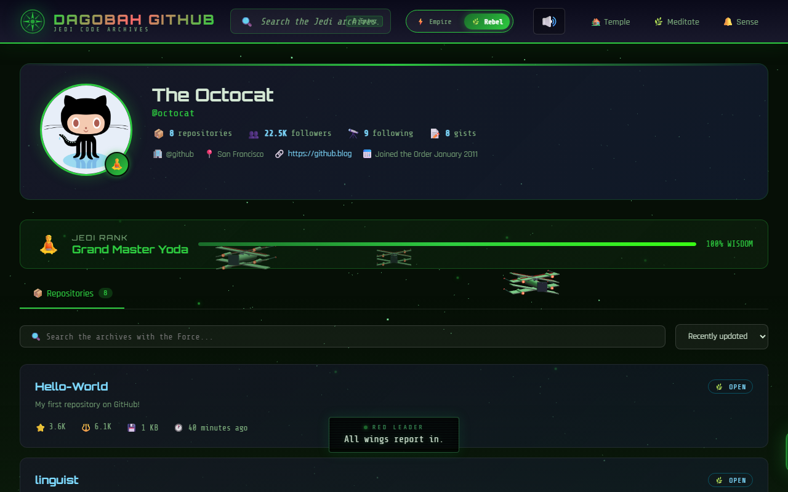
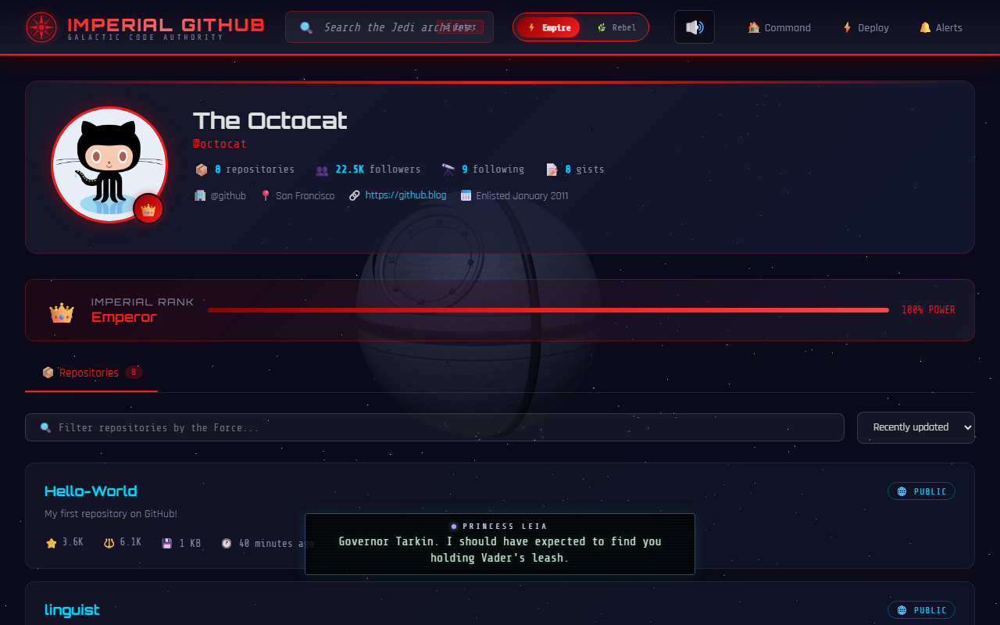

# ⚡ Imperial GitHub ⚡

> *"I find your lack of repositories disturbing."* — Darth Vader

A Star Wars-themed GitHub browser built for **May the 4th** (Star Wars Day). Browse real GitHub users, repos, and files — all wrapped in the power of the Dark Side... or the Light.

---

## 🌌 Choose Your Side

Toggle between two fully themed experiences:

### 🔴 Empire Theme — The Dark Side
Dark, menacing UI inspired by the Galactic Empire. Features a live **Death Star superlaser** sequence with cinematic dialogue between Grand Moff Tarkin, Princess Leia, and Darth Vader.



### 🟢 Rebel Theme — The Light Side
Yoda-inspired green palette with Dagobah fog and fireflies. Features the iconic **trench run** — X-Wings dive in, TIE Fighters pursue, and Luke fires the shot that saves the galaxy.



---

## 🎬 Live Battle Scenes

Both themes feature fully animated Three.js 3D battle scenes running as the page background, complete with synthesized sound effects and cinematic pilot dialogue.

### Death Star Superlaser (Empire)

The full Episode IV Alderaan destruction sequence — control room lever pull, tributary beam convergence, superlaser firing, and planetary explosion. With Tarkin and Leia's dialogue synced to every moment.


### Trench Run (Rebel)

Red Squadron's assault on the Death Star — the famous peel-off dive, first-person trench run, TIE Fighter pursuit, Biggs getting hit, Wedge pulling out, and Luke's impossible torpedo shot. Complete with pilot comm chatter.


---

## 🚀 Features

| Feature | Description |
|---|---|
| **GitHub Browser** | Search users, view profiles, browse repos, explore file trees, read READMEs |
| **Two Themes** | Empire (Dark Side) and Rebel (Light Side) with one-click toggle |
| **3D Battle Scenes** | Three.js animated backgrounds — Death Star superlaser & trench run |
| **Ship Models** | T-65B X-Wing, TIE Fighter, TIE Advanced x1, Death Star with surface detail |
| **Sound Engine** | Web Audio API synthesized effects — engines, lasers, explosions, TIE screech |
| **Dramatic Score** | 6-layer procedural orchestral music for the trench run |
| **Pilot Dialogue** | Color-coded Episode IV comm chatter synced to animation |
| **GPU Particles** | Buffer geometry particle explosions for Death Star destruction |
| **Cinematic Camera** | Multiple camera angles — chase cam, cockpit POV, Vader's perspective |
| **Imperial Ranks** | Users get assigned Sith/Jedi ranks based on their repo count |

## 🛠️ Tech Stack

- **Single HTML file** — no build step, no framework, pure vanilla
- **Three.js r128** — 3D rendering via CDN
- **Web Audio API** — all sound synthesized in-browser, no audio files
- **GitHub REST API** — real data, unauthenticated (rate-limited)
- **CSS Custom Properties** — theme switching via `data-theme` attribute

## 🏃 Run Locally

```bash
npx serve
```

Then open [http://localhost:3000](http://localhost:3000).

## 📜 License

MIT — use the Force wisely.

---

<p align="center">
  <i>May the Force be with you. Always.</i><br/>
  <b>Built for Star Wars Day — May 4th, 2026</b>
</p>
